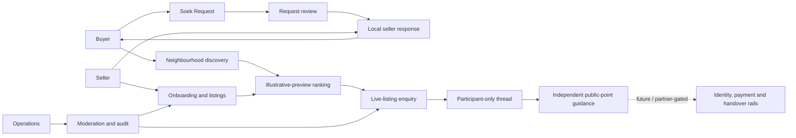

# Soek.Iets

> **Soek Iets** — “look for something” in Afrikaans.

Soek.Iets is a Windhoek-first marketplace concept built around a simple local truth: the most useful seller may already be in your neighbourhood, but today it can be difficult to discover that person, assess the trade and know which signals to trust.

The product starts with **approximate neighbourhood discovery**, then lets a buyer widen the circle to nearby areas or all of Windhoek. The illustrative preview catalogue explains its modelled recommendation reasons, while approved live listings use simple proximity-and-recency ordering. A future trade-linked reputation system is designed to rely on eligible recorded trades—not paid badges or social-media popularity—but it is not active in the private pilot.

This repository is a **public use-case and product-design record**. It intentionally excludes application source code, database schemas, credentials, private deployment configuration and operational security details.

## Product status

Soek.Iets is currently a **private pilot build**, not a publicly launched or regulated payment service.

| Capability | Status | What that means |
| --- | --- | --- |
| Neighbourhood-first discovery | Built for pilot | Browse by an approximate Windhoek area and widen the search radius when needed. |
| Explainable ranking | Built for illustrative preview | The labelled illustrative preview catalogue can cite proximity and modelled fulfilment, freshness and other understandable signals. Approved live listings remain separate and are ordered by approximate distance, then recency. |
| Approved listings and photos | Built for pilot | Reviewed member listings can enter the live catalogue with up to four access-controlled item photos; illustrative preview stock remains visibly separate. |
| Soek Requests and seller responses | Built for pilot | Buyer demand enters an approval queue before public display. Eligible sellers can answer an approved open request with one of their own live listings; buyers can shortlist or decline, and sellers can withdraw. |
| Buyer-to-seller enquiry threads | Built for pilot | A live-listing enquiry is routed to that listing’s owning seller and opens a participant-only message thread. Private contact details and owner identifiers stay hidden. Threads use manual refresh; push, email and SMS notifications are not active. |
| Buyer and seller onboarding | Built for pilot | Role-aware, mobile-friendly onboarding and saved progress. |
| Policy acceptance | Built for pilot | Onboarding records the accepted Terms, Privacy and Community Rules versions. A future material policy update still requires an approved re-acceptance process. |
| Marketplace dashboard | Built for pilot | Listings, requests, seller responses, sent activity and participant-only enquiry threads in one place. Listing owners can edit, pause, mark sold, remove or resubmit within the defined lifecycle. |
| Operations console | Built for pilot | Queues for listing review, Soek Request review, seller readiness, trust cases and attributed administrative actions. |
| Trade completion, reviews and reputation | Planned | The product design and labelled illustrative signals exist, but the private pilot does not record platform trade completion or offer trade-linked reviews or behaviour-based reputation. |
| TPTS identity/payment rails | Partner-gated | Not active. Activation requires signed scope, authorised providers, technical certification and operating procedures. |
| Protected payment, OTP handover and settlement | Planned | Never represented as live until the relevant provider and production checks are complete. |
| Integrated delivery | Planned | Handover guidance exists; no delivery provider, tracking or delivery guarantee is active. |
| Model-powered semantic search and risk assistance | Planned | Requires consent, representative pilot data, evaluation and human-review controls. |
| Public Namibia-wide launch | Not started | Windhoek comes first; expansion follows evidence, safety and operational capacity. |

The project uses a strict status vocabulary: **built**, **limited**, **partner-gated**, **planned** and **not started**. A roadmap item is never dressed up as a live protection.

## Why Soek.Iets is different

### 1. Near you before everywhere

Discovery begins with an approximate neighbourhood such as Khomasdal, Katutura, Wanaheda, Rocky Crest, Klein Windhoek or Cimbebasia. The product can then widen to neighbouring areas or city-wide results. Public discovery uses a named area rather than a dedicated seller home-address or live-location field; users must keep exact addresses and coordinates out of listing and message text.

### 2. Reasons, not a mysterious feed

The illustrative preview catalogue can say why an example appears, such as “in your neighbourhood”, a clearly modelled fulfilment signal, freshness or limited exploration for a new example seller. Approved live member listings do not use those modelled trust or fulfilment signals; within the selected view they are ordered by approximate distance, then recency. Any future production ranking must describe its real inputs and remain inspectable, measurable and open to human review.

### 3. Trust is a stack

The Soek.Iets design keeps current listing publication review separate from future identity status, payment state, handover confirmation and trade reputation. In the private pilot, the active evidence is seller-supplied listing facts and item photos reviewed by a human operator; publication is not identity, ownership, authenticity, payment or completion proof. If future layers activate, one badge must not conceal weaknesses elsewhere in a trade.

### 4. Built for local commerce

Prices are expressed in **Namibian dollars (`N$`)**. The writing, trading radii, examples and safety patterns are designed around Windhoek rather than copied from a generic global marketplace.

### 5. Small traders are first-class participants

The seller journey is designed for an individual with a phone and one useful product—not only for a formal retailer with a catalogue and a marketing team.

## How the marketplace fits together

The product is deliberately split into three layers:

- **Discovery:** neighbourhood selection, map exploration, product search, requests, labelled illustrative-preview ranking and simple live-listing ordering.
- **Trust:** current listing facts, photos, publication states, reporting and moderation, plus rules for future reputation features.
- **Regulated rails:** identity verification, money movement, settlement and provider-specific controls. These activate only after partner and production gates are met.

## The core journeys

**Buyer**

1. Choose an approximate home discovery area.
2. Browse nearby goods or widen the circle.
3. Use `Why this?` reasons for the illustrative preview catalogue; understand that approved live listings use proximity and recency instead.
4. Inspect seller-supplied facts, item photos and the human publication-review state without treating them as identity or ownership proof.
5. Send an enquiry to a real live listing, or submit a Soek Request for review and consider eligible seller responses.
6. In the current pilot, arrange a sensible public handover independently, inspect the item and use a payment method you understand. Use an integrated payment or recorded-handover flow only if a future in-product feature is explicitly marked active.

**Seller**

1. Create a buyer or seller profile from a phone.
2. Select a neighbourhood-level trading area and preferred radius.
3. Describe the item honestly, including condition and price in `N$`.
4. Submit the listing for marketplace review; only an approved listing becomes public stock.
5. Receive buyer questions and interest in a participant-only thread without receiving private contact details. Refresh the dashboard to see updates; no push, email or SMS notification is promised in the pilot.
6. Answer approved local demand with one of your own live listings, and withdraw that response when it is no longer relevant.
7. Edit or resubmit a listing for review, pause it, mark it sold or remove it as availability changes.
8. Build reputation through completed, policy-compliant trades only after the relevant completion and review rails exist.
9. Enter identity and payout verification only when authorised partner rails are active.

**Operations**

1. Review seller readiness without mislabelling it as identity verification.
2. Review listing quality, prohibited-item concerns and Soek Requests before publication.
3. Investigate reports through traceable trust cases.
4. Attribute material administrative actions.
5. Keep partner integrations visibly inactive until every go-live gate is passed.

## Documentation

- [Logical architecture](docs/architecture.md) — product surfaces, boundaries and integration states.
- [Pilot playbook](docs/pilot-playbook.md) — a practical Windhoek-first rollout and operating model.
- [Trust model](docs/trust-model.md) — threats, evidence layers, privacy and safety rules.
- [Rights notice](NOTICE.md) — copyright and permitted-use position for this repository.

## Launch principle

The private-to-public path is intentionally gated. The full build currently depends on an owner-private ChatGPT Sites authentication boundary. It must not be copied unchanged to ordinary public hosting: public access requires cryptographically verified portable sessions, stripped client-supplied identity headers, cross-site request protection, independently secured administration and tested session expiry/revocation.

A public release should happen only when that authentication boundary, the product, operating team, legal documents, safety response, partner scope, security review and production reconciliation can support the promise shown on screen. A read-only showcase is not equivalent to launching authenticated marketplace writes.

Public availability is not the finish line; it is the point at which every advertised protection must become an operational obligation.

## Repository boundary

This repository may be useful to marketplace founders, product teams, potential partners and community stakeholders evaluating the Soek.Iets use case. It is **not an open-source release** and does not grant a licence to reuse the name, artwork, copy or product design. See [NOTICE.md](NOTICE.md).
