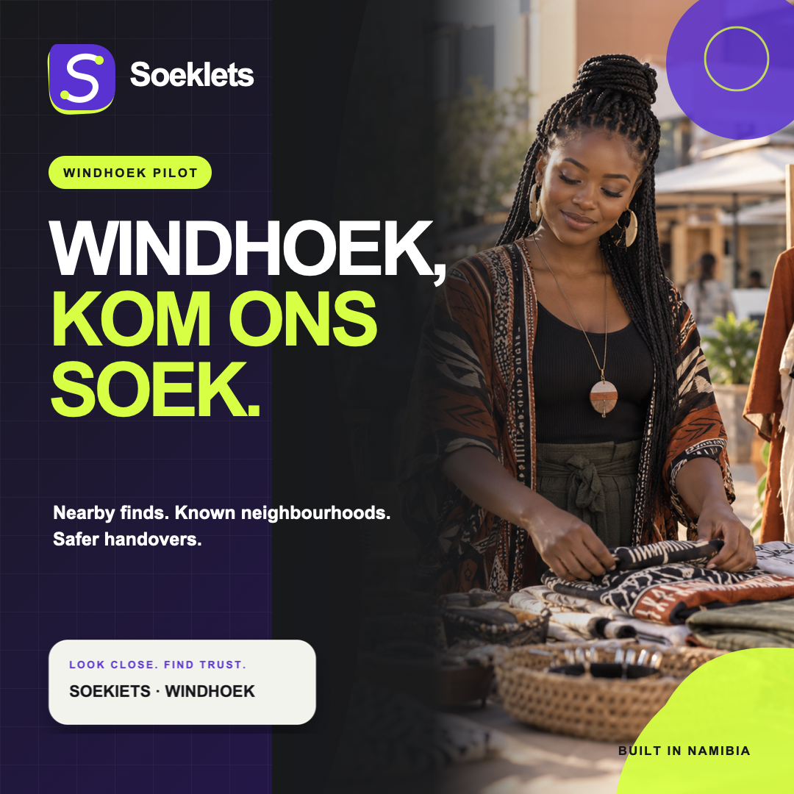
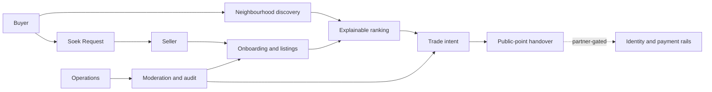

# SoekIets

> **Soek Iets** — “look for something” in Afrikaans.

SoekIets is a Windhoek-first marketplace concept built around a simple local truth: the most useful seller may already be in your neighbourhood, but today it can be difficult to discover that person, assess the trade and know which signals to trust.

The product starts with **approximate neighbourhood discovery**, then lets a buyer widen the circle to nearby areas or all of Windhoek. Recommendations explain themselves. Sellers build reputation through evidence and fulfilled trades—not through paid badges or social-media popularity alone.

This repository is a **public use-case and product-design record**. It intentionally excludes application source code, database schemas, credentials, private deployment configuration and operational security details.

## Product status

SoekIets is currently a **private pilot build**, not a publicly launched or regulated payment service.

| Capability | Status | What that means |
| --- | --- | --- |
| Neighbourhood-first discovery | Built for pilot | Browse by an approximate Windhoek area and widen the search radius when needed. |
| Explainable ranking | Built for pilot | Recommendations can cite proximity, fulfilment, freshness and other understandable signals. |
| Listings and Soek Requests | Built for pilot | Sellers can prepare inventory; buyers can express local demand. |
| Buyer and seller onboarding | Built for pilot | Role-aware, mobile-friendly onboarding and saved progress. |
| Marketplace dashboard | Built for pilot | Listings, requests, saved items and activity in one place. |
| Operations console | Built for pilot | Queues for listing review, seller readiness, trust cases and attributed administrative actions. |
| Reviews and mature reputation | Limited | The product model is defined; meaningful results require completed real trades and operational oversight. |
| TPTS identity/payment rails | Partner-gated | Not active. Activation requires signed scope, authorised providers, technical certification and operating procedures. |
| Protected payment, OTP handover and settlement | Planned | Never represented as live until the relevant provider and production checks are complete. |
| Model-powered semantic search and risk assistance | Planned | Requires consent, representative pilot data, evaluation and human-review controls. |
| Public Namibia-wide launch | Not started | Windhoek comes first; expansion follows evidence, safety and operational capacity. |

The project uses a strict status vocabulary: **built**, **limited**, **partner-gated**, **planned** and **not started**. A roadmap item is never dressed up as a live protection.

## Why SoekIets is different

### 1. Near you before everywhere

Discovery begins with an approximate neighbourhood such as Khomasdal, Katutura, Wanaheda, Rocky Crest, Klein Windhoek or Cimbebasia. The product can then widen to neighbouring areas or city-wide results. A seller’s home address or live location is never needed for public discovery.

### 2. Reasons, not a mysterious feed

A recommendation can say why it appears: “in your neighbourhood”, “high fulfilment”, “confirmed today” or “new local seller”. The current product uses understandable signals; any future model-powered ranking must remain inspectable, measurable and open to human override.

### 3. Trust is a stack

SoekIets keeps identity status, listing evidence, payment state, handover confirmation, trade reputation and moderation separate. One badge cannot conceal weaknesses elsewhere in a trade.

### 4. Built for local commerce

Prices are expressed in **Namibia dollars (`N$`)**. The writing, trading radii, examples and safety patterns are designed around Windhoek rather than copied from a generic global marketplace.

### 5. Small traders are first-class participants

The seller journey is designed for an individual with a phone and one useful product—not only for a formal retailer with a catalogue and a marketing team.

## How the marketplace fits together

The product is deliberately split into three layers:

- **Discovery:** neighbourhood selection, map exploration, product search, requests and explainable ranking.
- **Trust:** evidence, status labels, reputation rules, reporting, moderation and auditable decisions.
- **Regulated rails:** identity verification, money movement, settlement and provider-specific controls. These activate only after partner and production gates are met.

## The core journeys

**Buyer**

1. Choose an approximate home discovery area.
2. Browse nearby goods or widen the circle.
3. Understand why each result was recommended.
4. Inspect seller, item and trade signals separately.
5. Express interest or post a Soek Request.
6. Use a sensible public handover point and verify the item before completing an approved payment flow.

**Seller**

1. Create a buyer or seller profile from a phone.
2. Select a neighbourhood-level trading area and preferred radius.
3. Describe the item honestly, including condition and price in `N$`.
4. Submit the listing for marketplace review.
5. Respond to demand and build reputation through completed, policy-compliant trades.
6. Enter identity and payout verification only when authorised partner rails are active.

**Operations**

1. Review seller readiness without mislabelling it as identity verification.
2. Review listing quality and prohibited-item concerns.
3. Investigate reports through traceable trust cases.
4. Attribute material administrative actions.
5. Keep partner integrations visibly inactive until every go-live gate is passed.

## Documentation

- [Logical architecture](docs/architecture.md) — product surfaces, boundaries and integration states.
- [Pilot playbook](docs/pilot-playbook.md) — a practical Windhoek-first rollout and operating model.
- [Trust model](docs/trust-model.md) — threats, evidence layers, privacy and safety rules.
- [Rights notice](NOTICE.md) — copyright and permitted-use position for this repository.

## Launch principle

The private-to-public path is intentionally gated. A public release should happen only when the product, operating team, legal documents, safety response, partner scope, security review and production reconciliation can support the promise shown on screen.

Public availability is not the finish line; it is the point at which every advertised protection must become an operational obligation.

## Repository boundary

This repository may be useful to marketplace founders, product teams, potential partners and community stakeholders evaluating the SoekIets use case. It is **not an open-source release** and does not grant a licence to reuse the name, artwork, copy or product design. See [NOTICE.md](NOTICE.md).

