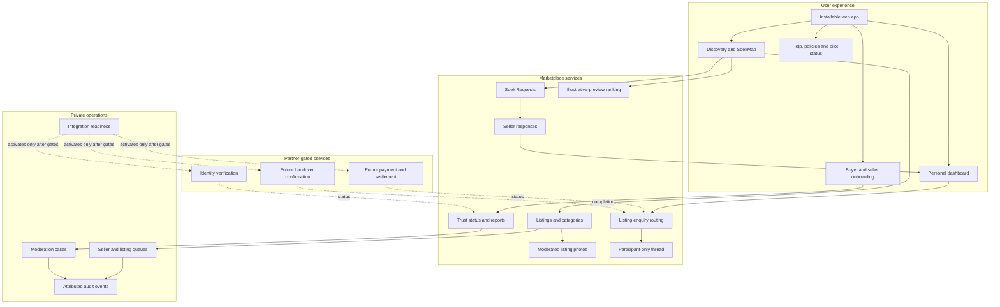
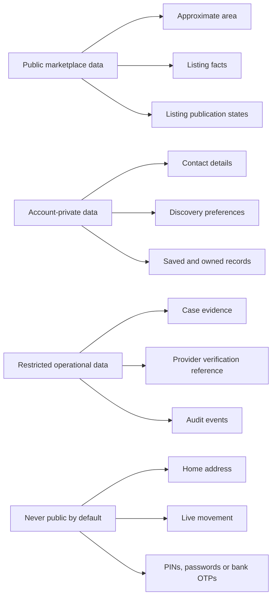

# Logical architecture

Soek.Iets is designed as a neighbourhood marketplace with a clear boundary between everyday product functions and partner-gated trust or payment functions. This document describes the public product architecture; it intentionally omits private source, database structures, infrastructure identifiers and security-sensitive implementation detail.

## Design goals

- Work comfortably on an ordinary smartphone and support installation as a progressive web application (PWA).
- Make the first useful result local without exposing a home address or live location.
- Keep illustrative-preview ranking reasons visible and understandable; do not attribute those modelled signals to approved live member listings.
- Give small traders a short, plain-language path from profile to first listing.
- Keep operational decisions traceable.
- Never simulate identity, payment or settlement assurances that are not active in production.
- Localise money, language and trading patterns for Namibia from the beginning.

## Product surfaces

## Neighbourhood discovery

The discovery centre is an **approximate named area**, not a household pin. The product supports three intuitive scopes:

1. **My neighbourhood** — the closest discovery circle.
2. **Nearby areas** — adjacent parts of Windhoek.
3. **All Windhoek** — broader city-wide discovery.

If a person chooses to use device location to find the nearest supported area, coordinates should be used only to determine the approximate neighbourhood unless a separate, clearly explained purpose is accepted. Public profiles and search results should expose the area name or an appropriate public trading zone—not a private address.

SoekMap visualises products and demand around approximate area centres. It is a discovery interface, not a live people-tracking map.

Approved database listings and their moderated photos are the live supply layer. Any illustrative preview catalogue or launch artwork must remain labelled and visually separable so it cannot be mistaken for a real seller, testimonial or completed trade.

## Preview ranking and live-listing order

The current explainable score belongs to the labelled illustrative preview catalogue. It can demonstrate several human-readable, modelled signals:

- approximate distance from the selected discovery area;
- seller trust or readiness evidence;
- fulfilment behaviour;
- listing freshness and availability confirmation;
- product popularity or relevance;
- measured exploration so a credible new seller is not permanently buried.

The illustrative preview interface can return reasons with the result, for example:

- `In Khomasdal`
- `2.1 km from your area`
- `Strong fulfilment across eligible trades`
- `Confirmed today`
- `New local seller`

Approved live member listings are a separate supply layer. Within the selected search, category and geographic scope, the current interface orders them by approximate distance and then recency; it does not assign the preview catalogue's modelled trust, fulfilment, popularity or seller-reputation signals to them.

Exact scoring weights and anti-abuse controls belong in the private product implementation. The public obligation is stable: any ranking should be testable, understandable and contestable, and its explanation must describe the factors actually applied to that result type.

Future model-powered search, personalisation or fraud assistance must not erase this obligation. Before activation it needs representative data, explicit success and harm measures, privacy review, bias evaluation, drift monitoring and a human path for consequential decisions.

## Trust-state architecture

Different questions produce different statuses. This table includes both current pilot states and explicitly future state families:

| Question | Example status family | Must not be confused with |
| --- | --- | --- |
| Did the seller complete product onboarding? | `incomplete`, `submitted`, `readiness approved` | Government-ID verification |
| Was identity checked by an authorised provider? | `not started`, `pending`, `verified`, `failed` | Popularity or reviews |
| Is the listing allowed and sufficiently evidenced? | `in review`, `live`, `rejected`, `paused`, `sold`, `removed` | Ownership guarantee or completed trade |
| What is happening with the trade? | **Future:** `interest`, `reserved`, `handover pending`, `complete`, `disputed` | Current enquiry `new`, `read` or `closed` state; payment settlement |
| What did the payment provider report? | **Future/provider-gated:** provider-defined verified states | Screenshots, SMS or user claims |
| What happened to a report? | `open`, `investigating`, `resolved`, `appealed` | A silent account restriction |

Seller-readiness approval is therefore a marketplace decision, not KYC. The operations console must preserve that distinction in copy and data.

The current pilot has no platform trade-completion record, protected payment state, recorded handover or trade-linked review/reputation state. Those future families are design boundaries, not implemented protections.

The pilot listing lifecycle gives the owner explicit availability controls. A new or materially edited listing enters review; approval makes it live; pause hides it without claiming a sale; `sold` is the owner's availability statement; remove withdraws it; and resubmit returns eligible content to review. These states are not payment, delivery or handover evidence.

## Operations architecture

The private operations surface is designed around queues rather than an unrestricted “super admin” screen:

- **Seller readiness:** assess completion and policy readiness before partner verification.
- **Listing review:** inspect condition, category, price, area and item evidence.
- **Soek Request review:** keep prohibited, deceptive or privacy-invasive demand off the public wire.
- **Trust cases:** triage reports, disputes and suspicious behaviour by priority.
- **Payment readiness:** show whether each partner rail is unavailable, in design, in certification or active.
- **Audit trail:** attribute material administrative actions to a known operator.

Onboarding also records the versions of the Terms, Privacy Notice and Community Rules the account accepted. That record answers which text was accepted; it does not, by itself, implement future re-consent. A material policy update needs an approved version rollout, clear notice and an account-action gate before the new version is treated as accepted.

Role allowlists, least privilege, durable logs and a controlled production activation process are expected deployment controls. Their sensitive implementation does not belong in this public repository.

## Data boundaries

Data collection should follow necessity and retention rules: collect what the current feature needs, state the reason plainly, restrict access and delete or anonymise it when the purpose ends. Partner verification results should be represented by the minimum status and reference needed to operate the marketplace; identity-document handling requires a separately approved design.

## Progressive web application

The web-installable route keeps distribution simple while preserving an app-like experience:

- responsive layouts for low-friction phone use;
- an install manifest and branded icons;
- safe caching for the application shell;
- route-aware offline fallback rather than stale cross-page content;
- accessible navigation, forms, empty states and recovery messages;
- no assumption that a user has a high-end device or permanent connection.

Offline support must never imply that a payment, identity check, listing publication or moderation action succeeded. Consequential writes require a confirmed server response.

## Buyer-to-seller enquiry boundary

A public live listing exposes only approved item facts, an approximate neighbourhood and a safe marketplace seller name. When a signed-in buyer sends interest or a question, the server resolves the listing again, confirms it is still live and derives the owning seller from the stored listing. The client never supplies the recipient.

The enquiry and follow-up thread are participant-scoped. The service supplies a safe display name and approximate trading area rather than dedicated email, phone, exact-location or internal-account fields. Free-text messages can still contain information a participant chooses to type, so policy, contact-detail filtering, reporting and human review remain necessary; users are told not to share addresses or coordinates. Follow-up writes re-check that the signed-in account is the buyer or listing owner and that the thread is open. A small status workflow such as `new`, `read` and `closed` is operational triage—not a claim that a conversation, trade or payment completed.

The current pilot has no push, email or SMS notifications and no delivery/read-receipt promise. Participants refresh the in-product dashboard to retrieve new messages. Adding a notification provider later would create a new consent, privacy, abuse and delivery-reliability boundary.

## Soek Request response boundary

A new Soek Request is private to its buyer while awaiting moderation. Only an approved open request enters the public neighbourhood-demand feed, and it exposes the demand description, category, budget and approximate area rather than the buyer's private identity or contact details.

An eligible seller can answer with one of their own live listings. The server derives the seller and buyer, validates the request and listing again, and limits each seller to one response per request. The buyer can shortlist or decline; the seller can withdraw. These states express discovery interest only: they do not reserve the item, create a payment, trigger delivery or prove completion.

## Listing-photo boundary

The pilot accepts a bounded number of JPEG, PNG or still WebP uploads, verifies container structure and dimensions, rejects animated or unsupported structures, removes supported metadata and stores the result outside the public application bundle. Delivery is mediated: owners and authorised operators can preview review-state images, while the public receives images only for live listings.

This is container validation and metadata scrubbing, not a full server-side codec decode/re-encode, malware scanner or semantic image verifier. Before broad public upload access, the production design should add a maintained image transformation boundary and monitoring appropriate to the threat model, plus tested orphan cleanup, retention and irreversible-delete procedures.

## Authentication and hosting boundary

The public test pilot runs on Cloudflare Pages with first-party, revocable D1-backed sessions. Passwords and opaque session tokens are stored only as one-way hashes, browser cookies are host-only and secure, and client-supplied identity headers are ignored on the public host. New test accounts are access-code controlled; verified email ownership, recovery and the final identity provider remain commercial-launch gates.

The current boundary deliberately supports controlled marketplace writes without claiming commercial-launch identity assurance. An unrestricted launch still requires verified email ownership, recovery, final identity-provider and administrator-role hardening, abuse testing and an owned-domain security review.

## Current boundary and production boundary

The current public test pilot includes approximate-neighbourhood discovery, approved live listings and moderated photos, onboarding records with policy-version acceptance, reviewed Soek Requests and seller responses, participant-only enquiry threads, owner listing lifecycle controls, a personal dashboard, operational queues and public policy/status surfaces.

The production boundary additionally requires:

- confirmed operating entity and customer-facing contact details;
- Namibia-specific legal and privacy review;
- signed scope with TPTS and/or another appropriately authorised provider;
- production identity, payment, settlement and reconciliation contracts;
- verified email ownership, recovery and role administration for the owned-domain launch environment;
- a maintained server-side image transformation and malware-monitoring decision for untrusted uploads;
- incident, dispute, refund, support and data-retention procedures;
- threat modelling, penetration testing and dependency review;
- monitoring, backups, recovery and controlled rollback;
- pilot evidence that users understand location, status and safety language.

No public launch should collapse these gates into a marketing date.
