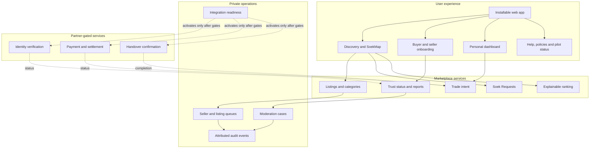
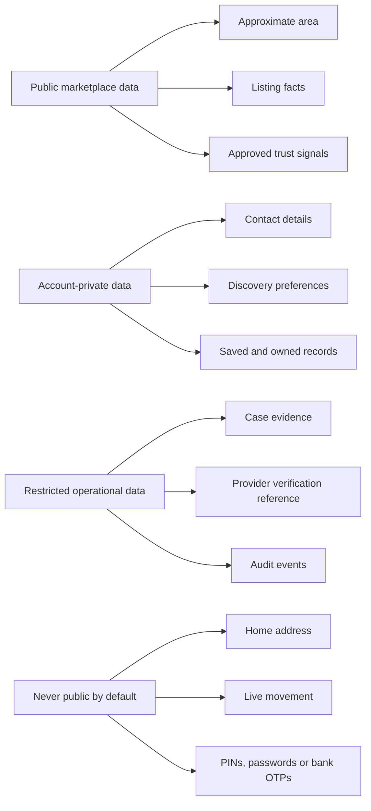

# Logical architecture

SoekIets is designed as a neighbourhood marketplace with a clear boundary between everyday product functions and partner-gated trust or payment functions. This document describes the public product architecture; it intentionally omits private source, database structures, infrastructure identifiers and security-sensitive implementation detail.

## Design goals

- Work comfortably on an ordinary smartphone and support installation as a progressive web application (PWA).
- Make the first useful result local without exposing a home address or live location.
- Keep ranking reasons visible and understandable.
- Give small traders a short, plain-language path from profile to first listing.
- Keep operational decisions traceable.
- Never simulate identity, payment or settlement assurances that are not active in production.
- Localise money, language and trading patterns for Namibia from the beginning.

## Product surfaces

## Neighbourhood discovery

The discovery centre is an **approximate named area**, not a household pin. The product supports three intuitive scopes:

1. **My neighbourhood** — the closest discovery circle.
2. **Nearby areas** — adjacent parts of Windhoek.
3. **All Windhoek** — broader city-wide discovery.

If a person chooses to use device location to find the nearest supported area, coordinates should be used only to determine the approximate neighbourhood unless a separate, clearly explained purpose is accepted. Public profiles and search results should expose the area name or an appropriate public trading zone—not a private address.

SoekMap visualises products and demand around approximate area centres. It is a discovery interface, not a live people-tracking map.

## Explainable ranking

The pilot ranking model can consider several human-readable signals:

- approximate distance from the selected discovery area;
- seller trust or readiness evidence;
- fulfilment behaviour;
- listing freshness and availability confirmation;
- product popularity or relevance;
- measured exploration so a credible new seller is not permanently buried.

The interface should return reasons with the result, for example:

- `In Khomasdal`
- `2.1 km from your area`
- `Strong fulfilment across eligible trades`
- `Confirmed today`
- `New local seller`

Exact scoring weights and anti-abuse controls belong in the private product implementation. The public obligation is stable: ranking should be testable, understandable and contestable.

Future model-powered search, personalisation or fraud assistance must not erase this obligation. Before activation it needs representative data, explicit success and harm measures, privacy review, bias evaluation, drift monitoring and a human path for consequential decisions.

## Trust-state architecture

Different questions produce different statuses:

| Question | Example status family | Must not be confused with |
| --- | --- | --- |
| Did the seller complete product onboarding? | `incomplete`, `submitted`, `readiness approved` | Government-ID verification |
| Was identity checked by an authorised provider? | `not started`, `pending`, `verified`, `failed` | Popularity or reviews |
| Is the listing allowed and sufficiently evidenced? | `draft`, `in review`, `live`, `rejected`, `paused` | Ownership guarantee |
| What is happening with the trade? | `interest`, `reserved`, `handover pending`, `complete`, `disputed` | Payment settlement |
| What did the payment provider report? | Provider-defined verified states | Screenshots, SMS or user claims |
| What happened to a report? | `open`, `investigating`, `resolved`, `appealed` | A silent account restriction |

Seller-readiness approval is therefore a marketplace decision, not KYC. The operations console must preserve that distinction in copy and data.

## Operations architecture

The private operations surface is designed around queues rather than an unrestricted “super admin” screen:

- **Seller readiness:** assess completion and policy readiness before partner verification.
- **Listing review:** inspect condition, category, price, area and item evidence.
- **Trust cases:** triage reports, disputes and suspicious behaviour by priority.
- **Payment readiness:** show whether each partner rail is unavailable, in design, in certification or active.
- **Audit trail:** attribute material administrative actions to a known operator.

Role allowlists, least privilege, durable logs and a controlled production activation process are expected deployment controls. Their sensitive implementation does not belong in this public repository.

## Data boundaries

Data collection should follow necessity and retention rules: collect what the current feature needs, state the reason plainly, restrict access and delete or anonymise it when the purpose ends. Partner verification results should be represented by the minimum status and reference needed to operate the marketplace; identity-document handling requires a separately approved design.

## Progressive web application

The web-installable route keeps distribution simple while preserving an app-like experience:

- responsive layouts for low-friction phone use;
- an install manifest and branded icons;
- safe caching for the application shell;
- route-aware offline fallback rather than stale cross-page content;
- accessible navigation, forms, empty states and recovery messages;
- no assumption that a user has a high-end device or permanent connection.

Offline support must never imply that a payment, identity check, listing publication or moderation action succeeded. Consequential writes require a confirmed server response.

## Current boundary and production boundary

The current private pilot includes the discovery experience, onboarding records, listing and request flows, personal dashboard, operational queues and public policy/status surfaces.

The production boundary additionally requires:

- confirmed operating entity and customer-facing contact details;
- Namibia-specific legal and privacy review;
- signed scope with TPTS and/or another appropriately authorised provider;
- production identity, payment, settlement and reconciliation contracts;
- tested authentication and role administration outside the private workshop environment;
- incident, dispute, refund, support and data-retention procedures;
- threat modelling, penetration testing and dependency review;
- monitoring, backups, recovery and controlled rollback;
- pilot evidence that users understand location, status and safety language.

No public launch should collapse these gates into a marketing date.
