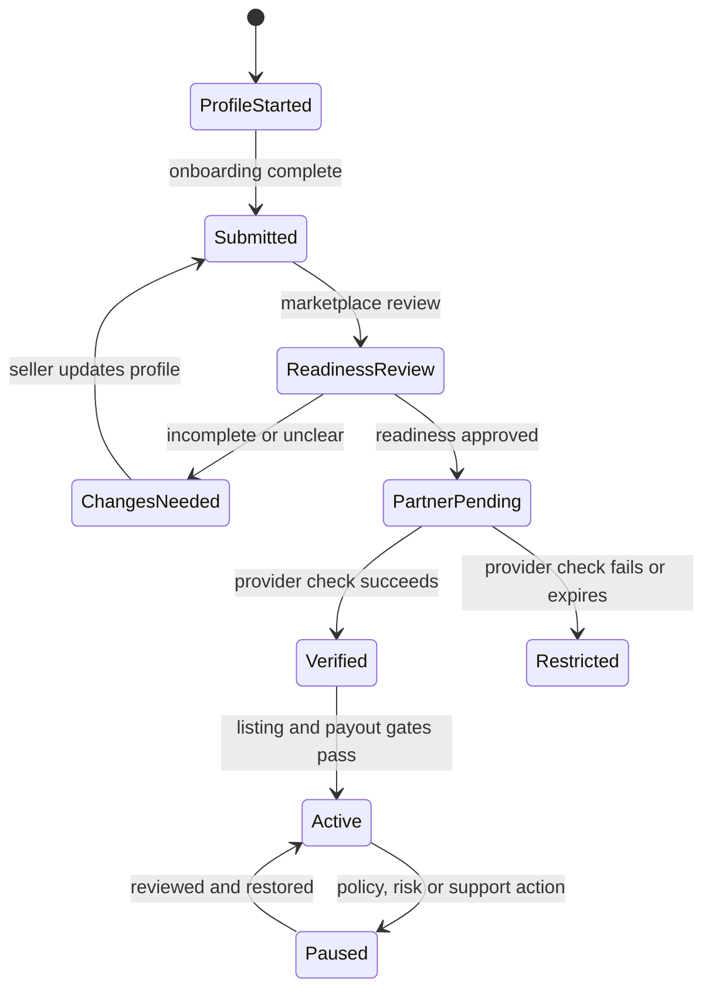

# Windhoek pilot playbook

The SoekIets pilot should prove one focused proposition: **can neighbourhood-first discovery and evidence-led trust make small local trades easier to find and safer to assess?**

This is an operating playbook, not a claim that a public service, regulated payment product or national marketplace is already live.

## Pilot scope

**Geography:** Windhoek only.

**Initial users:** a small, deliberately recruited group of buyers and micro-sellers who can be supported directly.

**Useful categories:** pre-loved goods, local craft, fashion, home, children’s items, electronics, business tools and sport. Categories may be restricted further when moderation or safety capacity is not ready.

**Currency:** Namibia dollars, consistently formatted as `N$`.

**Discovery unit:** approximate neighbourhood or public trading area. Never a seller’s private address.

**Pilot success:** evidence of useful discovery, understandable trust signals, reliable fulfilment and operable safety—not vanity registration numbers.

## Staged rollout

```mermaid
flowchart LR
    A[Private product alpha] -->|quality gates pass| B[Invited seller preparation]
    B -->|inventory and moderation ready| C[Closed buyer pilot]
    C -->|safety and fulfilment evidence| D[Partner certification]
    D -->|legal, security and operations sign-off| E[Controlled public Windhoek launch]
    E -->|measured local density and support capacity| F[Wider Namibia evaluation]
```

### Stage 1 — Private product alpha

- Complete core journeys on common phone widths.
- Confirm all price displays use `N$`.
- Exercise success, empty, loading, error and permission-denied states.
- Confirm every button and link has a real destination or a clear unavailable status.
- Verify that exact private locations do not appear in discovery.
- Confirm planned payment and identity features are visibly inactive.

### Stage 2 — Invited seller preparation

- Recruit a manageable group across several Windhoek neighbourhoods.
- Help each seller create accurate listings with current photographs and condition notes.
- Review categories and prohibit items the team cannot safely moderate.
- Record seller-readiness decisions without describing them as KYC.
- Test support and listing-review turnaround before inviting buyers.

### Stage 3 — Closed buyer pilot

- Invite buyers in areas with enough relevant inventory.
- Observe whether users understand `My neighbourhood`, `Nearby areas` and `All Windhoek`.
- Ask users to explain why a recommendation appeared; revise any unclear reason.
- Test Soek Requests where inventory is thin.
- Use public-point handover guidance and record fulfilment outcomes.
- Keep payment outside any “protected” claim until a production partner rail is active.

### Stage 4 — Partner certification

- Agree the exact role of SoekIets, TPTS and any other authorised providers.
- Complete commercial, regulatory, privacy and security review.
- Define identity, payment, webhook, timeout, reversal and reconciliation contracts.
- Test failure paths, duplicate events, interrupted handovers and provider downtime.
- Train support and operations staff before enabling any user-facing status.

### Stage 5 — Controlled public Windhoek launch

- Release by supported geography and category rather than opening every market at once.
- Maintain daily trust-and-safety coverage during the initial launch window.
- Monitor supply quality, buyer demand, completion, cancellations, reports and response time.
- Pause growth when operational capacity or safety quality falls below the agreed threshold.

## Pre-pilot checklist

### Product

- [ ] Buyer, seller and operations journeys pass device and accessibility QA.
- [ ] Listing, request, save and trade-intent actions persist reliably.
- [ ] Recommendation reasons match the ranking behaviour.
- [ ] PWA update and offline behaviour cannot display a stale route as the current page.
- [ ] No placeholder statistics, fake reviews or fabricated live activity appear.
- [ ] Every integration is labelled with its actual activation state.

### Safety and operations

- [ ] Prohibited-items policy and seller rules are approved.
- [ ] Reports create a traceable case with owner, priority and status.
- [ ] Escalation paths exist for suspected fraud, threats, illegal goods and vulnerable users.
- [ ] Public handover guidance is visible in the trade journey.
- [ ] Administrative roles follow least privilege.
- [ ] Material moderation actions are logged and reviewable.

### Legal and privacy

- [ ] Operating entity, customer-facing contacts and complaint channel are confirmed.
- [ ] Terms, privacy notice, community rules and seller terms receive Namibia-specific counsel review.
- [ ] Data inventory, lawful basis, retention and deletion procedures are documented.
- [ ] Provider roles and data-processing responsibilities are contractually clear.
- [ ] Marketing claims match the product’s live status.

### Partner and financial rails

- [ ] TPTS and/or another appropriately authorised provider has approved the production scope.
- [ ] No flow relies on a screenshot or forwarded message as payment proof.
- [ ] Fees, limits, settlement timing, refunds and disputes are disclosed before commitment.
- [ ] Reconciliation and exception handling pass production-like tests.
- [ ] A rollback or feature-disable path is rehearsed.

### Security and resilience

- [ ] Threat model and abuse cases are reviewed.
- [ ] Authentication, session handling and administrative access are tested.
- [ ] Dependency, secret and deployment configuration checks pass.
- [ ] Backups, restore, monitoring and incident communications are rehearsed.
- [ ] Security findings have owners and launch-blocking severity criteria.

## Seller activation workflow

Marketplace readiness and provider verification remain separate throughout this workflow.

## Listing-review standard

A listing can move toward publication when an operator can answer yes to each applicable question:

1. Is the title specific and not misleading?
2. Is the condition stated plainly—new, pre-loved, handmade or refurbished?
3. Is the `N$` price plausible and free of hidden mandatory charges?
4. Does current item evidence match the description?
5. Is the approximate neighbourhood sufficient without exposing a home address?
6. Is the category allowed and within current moderation capacity?
7. Are warranty, invoice, ownership or safety claims supported where required?
8. Does the listing avoid off-platform payment pressure or fake urgency?

## Daily operating rhythm

**Opening review**

- Check system health, partner status and unresolved high-priority cases.
- Review overnight reports and listings that may create immediate harm.
- Confirm that public status notices match reality.

**Queue work**

- Process seller readiness and listing review in received order unless risk changes priority.
- Record the reason for rejection, pause or restriction.
- Separate support questions from trust-and-safety investigations.

**Marketplace quality**

- Review demand with thin supply and inventory with no useful exposure.
- Look for repeated images, duplicate descriptions, improbable pricing and account clusters.
- Check whether new sellers receive fair exploration without weakening safety.

**Closing review**

- Reconcile unresolved cases, handovers and partner exceptions.
- Assign every open high-priority item to a named owner.
- Record incidents, decisions and changes needed before the next operating window.

## Incident priorities

| Priority | Example | Initial action |
| --- | --- | --- |
| Critical | Credible threat to physical safety, active account takeover or material payment-system incident | Restrict affected capability, preserve evidence, escalate immediately and follow the incident plan. |
| High | Suspected fraud ring, prohibited high-risk item, repeated impersonation or compromised seller | Pause relevant accounts/listings, investigate linked activity and notify the responsible operator. |
| Medium | Misleading condition, fulfilment dispute, harassment or repeated policy breach | Open a case, gather both sides and apply proportionate restrictions. |
| Low | Copy quality, category correction or ordinary support request | Route to the normal queue and resolve with a clear explanation. |

Exact response targets should be set only after staffing and support hours are committed. This document does not invent them.

## Pilot measures

Define each measure before collecting it and report denominators alongside rates.

### Marketplace usefulness

- Search-to-relevant-result rate by neighbourhood and category.
- Time from first search to a meaningful item view or Soek Request.
- Demand coverage: requests that receive a relevant seller response.
- Local density: useful active listings per supported area/category.

### Trade reliability

- Fulfilment rate among trades that reached an agreed handover.
- Cancellation rate, split by buyer, seller and system/partner cause.
- Dispute and report rate per completed trade.
- Repeat participation after a successfully completed trade.

### Trust comprehension

- Percentage of tested users who correctly interpret readiness, verification and review statuses.
- Percentage who identify that payment screenshots are not proof.
- Report discovery and completion rate in usability testing.
- Appeals and overturned moderation decisions.

### Operations

- Queue age by type and priority.
- Time to first meaningful action on safety reports.
- Share of actions with complete reason and audit attribution.
- Partner exceptions that reconcile automatically versus manually.

No target should be chosen merely because it looks impressive. Targets must reflect actual staffing, category risk and user harm tolerance.

## Public-launch gates

| Gate | Evidence required | Owner type |
| --- | --- | --- |
| Product quality | Full journey QA, recovery states, accessibility and mobile acceptance | Product and engineering |
| Trust operations | Trained reviewers, case procedures, escalation and appeal path | Marketplace operations |
| Legal and privacy | Approved terms/notices, operating entity, data and provider roles | Legal/privacy |
| Security | Resolved launch blockers, access review, monitoring, restore and incident drill | Security/engineering |
| TPTS/provider | Signed scope, certification, support model, settlement and reconciliation | Partner/finance |
| Marketplace health | Adequate useful supply and supportable invited demand | Pilot lead |
| Communications | Claims, launch material and status page match live capability | Product/communications |

If one gate fails, the corresponding feature stays inactive or the launch pauses. “Almost ready” is not an integration state.

## Expansion rule

SoekIets should not expand beyond Windhoek because the map looks small. Expansion becomes reasonable when the pilot demonstrates:

- enough local supply and demand to make neighbourhood discovery useful;
- stable fulfilment and a manageable incident rate;
- support and moderation capacity that scales with participation;
- partner rails that reconcile reliably;
- users who understand the platform’s trust and location language;
- a repeatable method for mapping areas without exposing exact locations.

The next city or town is a new operating context, not a copy-and-paste switch.

