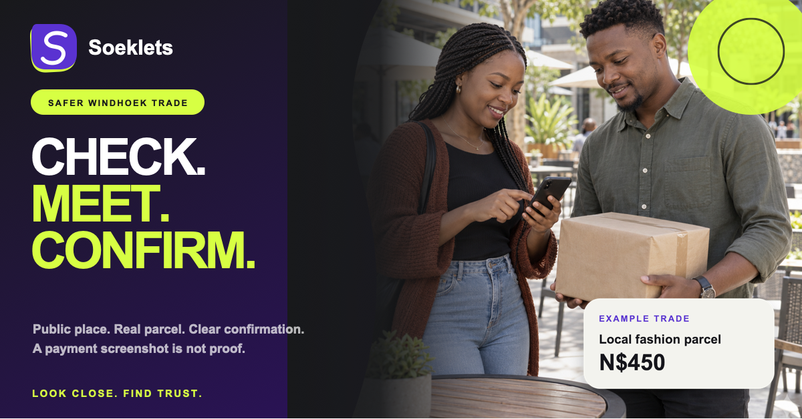
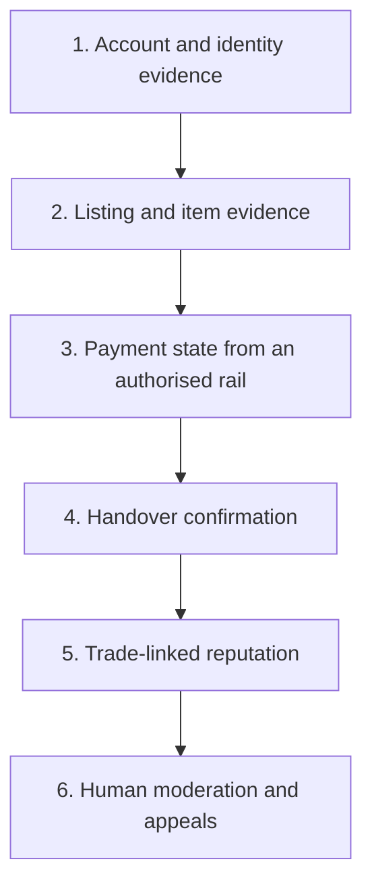
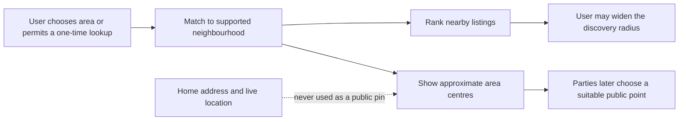

# Trust model

SoekIets assumes that a friendly profile, a familiar neighbourhood and a convincing screenshot can all be faked. Trust therefore comes from multiple independent pieces of evidence and a visible operating process—not from one score or badge.

## Trust objectives

1. Help a buyer decide whether to start and complete a trade.
2. Help a legitimate small seller turn reliable behaviour into reputation.
3. Reduce the value of impersonation, fake payment proof and throwaway accounts.
4. Protect exact private locations while keeping proximity useful.
5. Give operators enough traceability to investigate and appeal decisions.
6. Keep planned safeguards visibly separate from live safeguards.

## Threats in scope

| Threat | Typical pattern | Product response |
| --- | --- | --- |
| Impersonation | A scammer copies a known seller’s name, image or WhatsApp profile | Account ownership controls, provider-gated identity status, duplicate-signal review and report handling. |
| Fake payment proof | A buyer sends an edited screenshot, SMS or “pending” notification | Accept payment state only from the active authorised rail; never from forwarded evidence. |
| Non-existent or misdescribed item | Stolen photos, hidden damage or bait-and-switch pricing | Current item evidence, condition fields, moderation and trade-linked reporting. |
| Account farming | Many throwaway profiles manipulate visibility or reviews | Stable account identity, rate and linkage signals, completed-trade review eligibility and human review. |
| Review manipulation | Friends or duplicate accounts inflate reputation | Reviews only after eligible completed trades; detect reciprocal and clustered behaviour. |
| Location harm | A public listing reveals a home or a live movement pattern | Show approximate area or public trading point; minimise coordinate retention and access. |
| Off-platform pressure | “Pay me directly for a discount” or “send the OTP now” | Persistent warnings, report actions and policy enforcement; never ask for bank PINs or login OTPs. |
| Insider misuse | An operator changes status or views sensitive material without need | Least privilege, attributed actions, audit review and case-specific access. |
| Model overreach | Automated risk or ranking silently disadvantages a group | Explainability, evaluation, monitoring, human review and an appeal route before consequential use. |

## The six-layer evidence stack

### 1. Account and identity evidence

Product onboarding can establish an accountable account and gather seller information. It cannot, by itself, prove a government identity. A `readiness approved` seller is therefore still distinct from a seller whose identity an authorised provider has verified.

When provider verification becomes active, the marketplace should store and display only the status and reference necessary for the service. Document images, biometric data and detailed failure reasons require stricter necessity, access and retention decisions.

### 2. Listing and item evidence

Item trust begins with a current, specific description:

- condition and known defects;
- original or current photographs;
- price and mandatory fees in `N$`;
- availability and approximate trading area;
- serial, invoice, warranty or ownership evidence only where justified;
- category-specific safety information.

Evidence can improve confidence but should not be described as a guarantee of ownership or quality unless an accountable process actually supports that promise.

### 3. Payment state

The platform’s payment status must come from the activated provider interface and survive duplicate, delayed, failed and reversed events. A screenshot, forwarded SMS, email or user statement is never authoritative proof.

Before any protected-payment wording appears, users must be able to understand:

- which provider moves or holds the funds;
- the amount, fee, limit and settlement timing;
- what happens on cancellation, timeout, dispute and reversal;
- which party provides support;
- whether the feature is available for that specific trade.

TPTS and/or another appropriately authorised provider is a partner-gated route for this layer. It is not active merely because the interface has been designed.

### 4. Handover confirmation

A future confirmation mechanism can bind the correct buyer, seller and trade to the handover event. It should use a purpose-specific code or action—not a banking PIN, account password or login OTP.

Handover should favour sensible public points. The exact agreed meeting detail is revealed only to the parties when needed and should not become part of the public seller profile.

### 5. Trade-linked reputation

Reviews should unlock only after an eligible completed trade. Reputation can then include:

- fulfilled versus cancelled commitments;
- condition accuracy;
- communication and handover reliability;
- resolved and upheld disputes;
- recent behaviour and the number of eligible trades.

The number alone is not enough. Show the sample size, explain material components and avoid giving a new seller a permanent disadvantage. Paid promotion must never masquerade as trust.

### 6. Human moderation and appeals

Reports become cases with a subject, reason, priority, status, evidence and attributed decisions. A proportionate response may include requesting changes, pausing a listing, limiting a feature, restricting an account or escalating to the appropriate authority or provider.

Consequential decisions should be explained at a useful level and provide an appeal route where appropriate. The audit trail should capture who changed what and when without becoming public exposure of sensitive case material.

## Approximate location model

Privacy and usefulness reinforce each other here: a named area is sufficient for local discovery, while a specific meeting place matters only when the parties are ready to arrange a handover.

Controls should include:

- coarse public area labels;
- no continuous background tracking;
- clear permission text for any device-location lookup;
- no public movement history;
- restricted access to private handover details;
- deletion or anonymisation when the operational purpose ends.

## Explainable recommendations

Every prominent recommendation should answer “Why this?” in plain language. Reasons should describe the actual factors used and avoid overstating confidence.

Good examples:

- `In your selected neighbourhood`
- `High fulfilment across eligible trades`
- `Availability confirmed today`
- `A newer seller being given limited local exposure`

Bad examples:

- `AI verified` when no verification happened;
- `100% safe` or `scam-proof`;
- `Most trusted` without a defined eligible comparison set;
- a precise distance derived from private live coordinates shown to other users.

If a future model contributes to ranking or fraud assistance, the product should retain the input category, reason, confidence/use boundary and human-review path needed to challenge a result.

## Status and badge rules

1. A badge represents one named check, not universal safety.
2. Status text must identify the actor: marketplace reviewed, provider verified, buyer confirmed or seller stated.
3. Expired or revoked checks lose active presentation promptly.
4. “Pending” is not displayed as “verified”.
5. Marketplace readiness never substitutes for KYC.
6. A live payment indicator is derived from the provider state, not user-uploaded proof.
7. “Most trusted” and “best seller” require a stated eligibility window and enough completed activity; otherwise the interface should use a more modest description.

## Safe-trade guidance

Users should see concise, repeated advice at the moment it matters:

- inspect the item and confirm condition;
- prefer a reasonable public handover point;
- do not share bank PINs, passwords or login OTPs;
- do not treat a screenshot as proof of payment;
- stop when another person creates unusual urgency or tries to bypass the active flow;
- report impersonation, illegal items, harassment and suspicious payment behaviour.

The product should never imply that guidance transfers all risk to the user. It is one layer alongside product controls, provider evidence and responsive operations.

## What is intentionally not claimed today

The private pilot does not currently claim:

- completed government-ID verification;
- integrated or protected payment;
- escrow or guaranteed refunds;
- OTP-confirmed settlement;
- integrated courier tracking;
- mature reputation based on a large body of real trades;
- autonomous AI fraud decisions;
- national Namibia coverage.

These remain inactive until the corresponding legal, partner, security, operational and product gates are complete and the live interface says so.

## Trust review cadence

During the pilot, the team should review:

- emerging scam patterns and copied content;
- report and dispute reasons by category and area;
- false positives, overturned decisions and appeal quality;
- whether users understand every badge and status;
- whether ranking gives credible new sellers appropriate exposure;
- partner exceptions, delayed events and reconciliation gaps;
- staff access and audit completeness;
- whether collected data is still necessary.

The trust model is a living operating system. New features change the threat surface and require a fresh review before they change the promise made to users.
